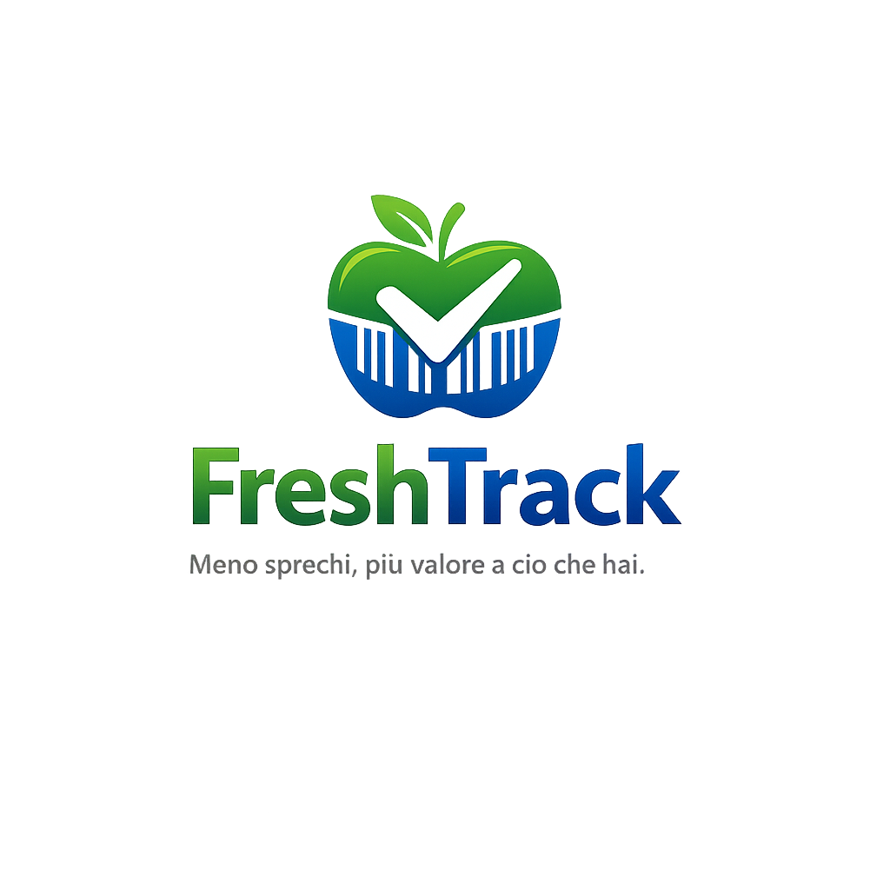
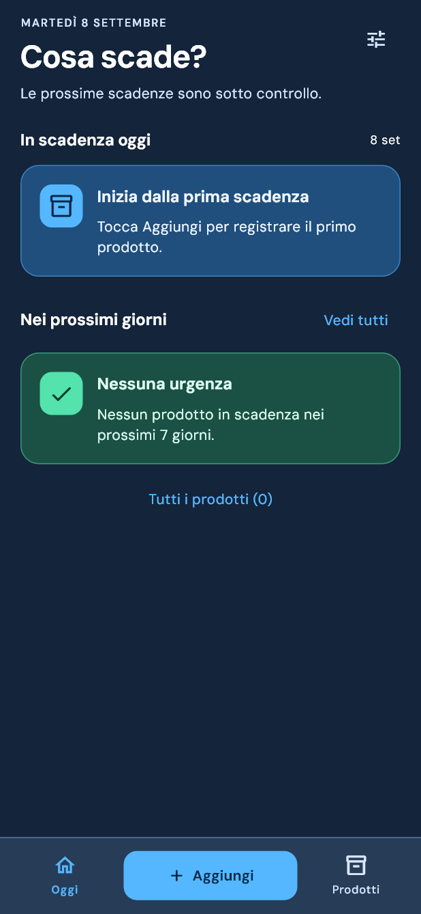
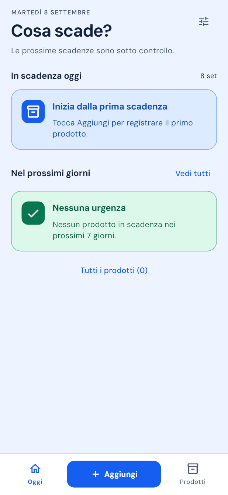
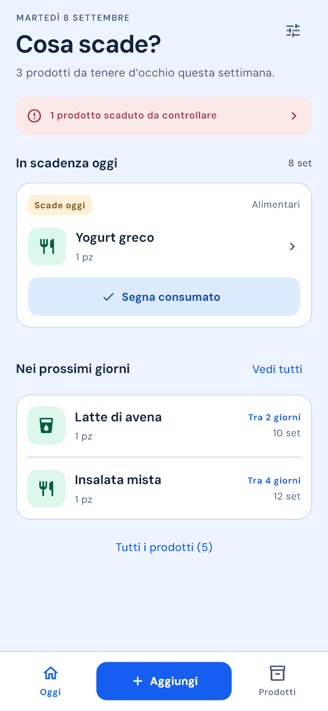
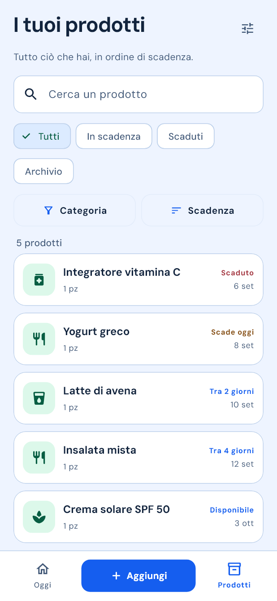
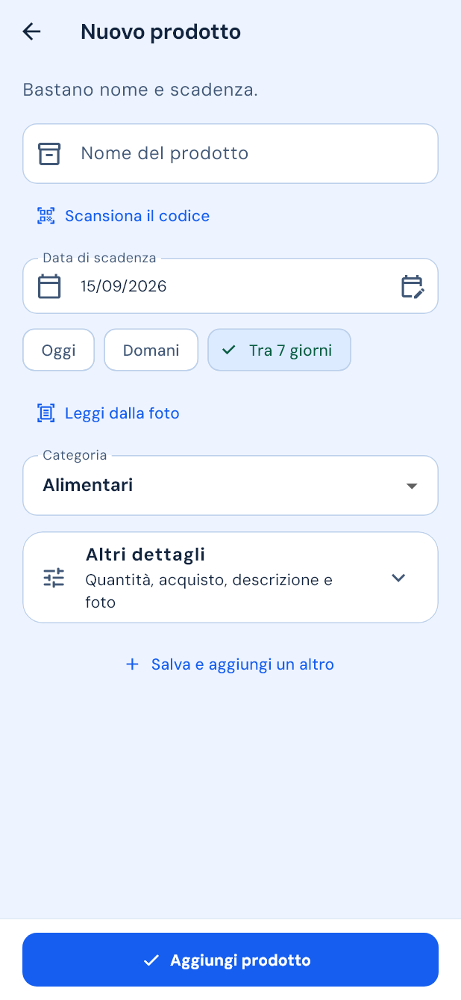
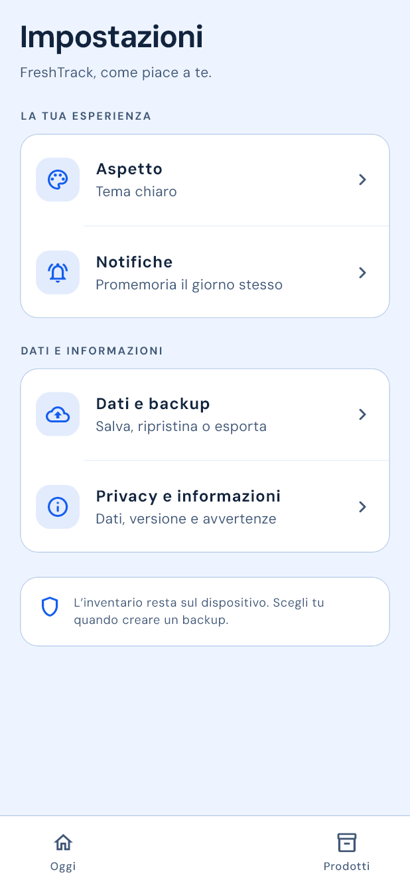
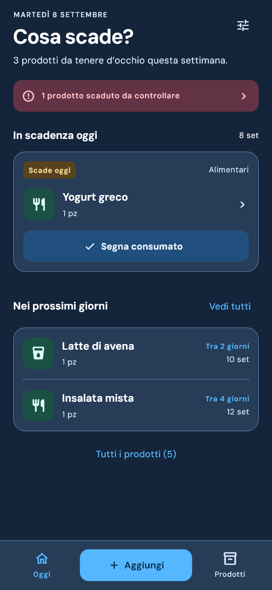
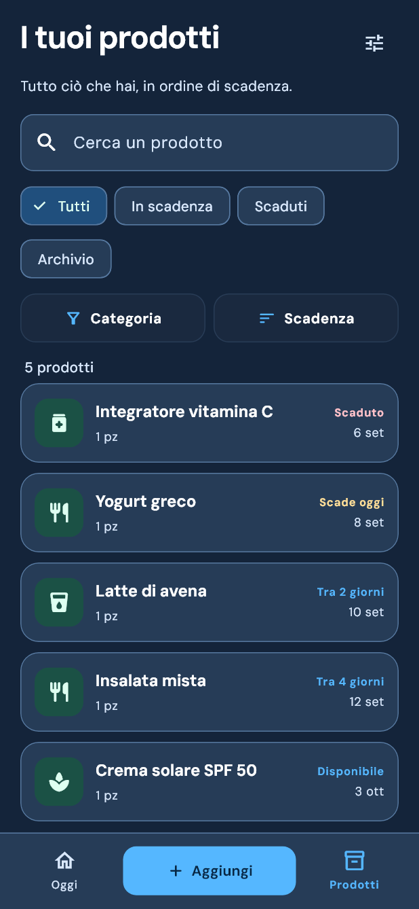

# FreshTrack

<p align="center">
  
</p>

FreshTrack è un'app Android offline-first per gestire le scadenze di alimenti,
bevande, farmaci e prodotti per la cura personale, riducendo sprechi e
dimenticanze.

Il progetto è sviluppato in Flutter con Material 3 e Clean Architecture.
Il package Android è `io.github.kaonashi98.freshtrack` ed è mantenuto da
[Nicola Zingaro](https://github.com/Kaonashi98).

L'inventario resta sul dispositivo: FreshTrack non richiede account né API key
e non invia allo sviluppatore prodotti, foto o scadenze. La connessione viene
usata su richiesta per cercare un prodotto tramite Open Food Facts; gli SDK
Google ML Kit trasmettono inoltre metriche tecniche, ma non immagini, testo
riconosciuto o inventario.

## Funzionalità

- Home con scadenze di oggi, prossimi sette giorni e avviso per i prodotti scaduti;
  azioni rapide consumato/utilizzato con Annulla.
- Inventario con ricerca, filtri rapidi per scadenze/scaduti/archivio,
  categoria e ordinamento per scadenza, nome o inserimento.
- Categorie della versione 1.0: Alimentari, Bevande, Farmaci e Cura personale.
- Aggiunta con scelta tra scansione e inserimento manuale; nome, categoria e scadenza in primo piano; quantità,
  acquisto, descrizione e foto restano in una sezione facoltativa.
- Suggerimenti dai prodotti già usati, duplicazione e azione “Salva e aggiungi
  un altro” per inserire più articoli con meno passaggi.
- Scansione barcode con ricerca opzionale su Open Food Facts e compilazione
  manuale sempre disponibile in assenza di rete.
- Riconoscimento sul dispositivo della data da una foto, sempre sottoposta alla
  conferma dell'utente.
- Creazione e modifica dei prodotti con foto da fotocamera o galleria.
- Azioni per segnare i prodotti come consumati, utilizzati o buttati, con
  ripristino allo stato disponibile.
- Modifica ed eliminazione definitiva con flussi di conferma.
- Indicatori visivi per prodotti freschi, in scadenza e scaduti.
- Notifiche locali nel giorno della scadenza; preavviso e orario sono configurabili. Android può ritardare l’orario di alcuni minuti.
- Apertura dell'elenco corretto toccando una notifica.
- Tema chiaro, scuro o di sistema.
- Lingua automatica: italiano sui dispositivi in italiano, inglese su tutti gli
  altri; selezione manuale Sistema, Italiano o English dalle Impostazioni.
- Backup ZIP manuale con prodotti, preferenze e foto, ripristino con anteprima e
  scelta tra unione o sostituzione. L'unione conserva la versione più recente
  di ogni prodotto e, a parità di data, mantiene quella attuale.
- Esportazione CSV compatibile con Excel e Fogli Google.
- Impostazioni divise in aree semplici e cancellazione completa protetta dalla
  possibilità di creare prima un backup.

## Anteprima

Interfaccia azzurra e verde della build 10, con testi più leggibili e schede
colorate anche a inventario vuoto. Anteprime renderizzate dai widget Flutter,
con dati dimostrativi dove presenti. Il [resoconto della revisione](docs/ui_leggibilita_build10_2026-09-08.md)
documenta le modifiche e le verifiche.

| Home vuota: scuro | Home vuota: chiaro |
| --- | --- |
|  |  |

| Dashboard | Prodotti |
| --- | --- |
|  |  |

| Nuovo prodotto | Impostazioni |
| --- | --- |
|  |  |

| Tema scuro: home | Tema scuro: prodotti |
| --- | --- |
|  |  |

## Stack tecnico

- Flutter e Dart
- Material 3
- Riverpod
- GoRouter
- Drift / SQLite
- `flutter_local_notifications`
- `image_picker`
- `mobile_scanner`
- ML Kit Text Recognition
- Open Food Facts API v3.6, database ODbL
- `archive` e `file_picker`
- `shared_preferences`

## Architettura

Il progetto separa regole di business, accesso ai dati e interfaccia:

```text
lib/
├── core/           # tema, router e composizione dell'app
├── data/           # Drift, repository, notifiche, impostazioni e media
├── domain/         # entità, contratti e logica delle scadenze
├── presentation/   # schermate, provider e coordinatori
└── shared/         # componenti UI riutilizzabili
```

La UI dipende dai contratti del dominio. Drift e i servizi Android rimangono
confinati nel data layer. Le modifiche ai prodotti alimentano uno stream unico,
usato anche per aggiornare e cancellare automaticamente le notifiche.

Le scritture e i trasferimenti condividono l'accesso esclusivo ai repository.
La cancellazione completa continua anche se la pagina viene chiusa; i backup
vengono elaborati fuori dal thread dell'interfaccia e le dimensioni ZIP vengono
controllate durante la decompressione. I limiti sono 5000 prodotti, 20 MB per
foto, 32 MB per manifest e 250 MB complessivi, compressi e decompressi.

## Avvio in locale

Requisiti:

- Flutter stabile 3.44 o successivo
- Android Studio e Android SDK
- JDK 17 o successivo
- dispositivo o emulatore Android API 24+

```bash
flutter pub get
flutter analyze
flutter test
flutter run
```

## Test e qualità

La suite comprende test di dominio, repository Drift e widget test dei flussi
principali:

```bash
flutter analyze
flutter test --coverage
cd android
./gradlew :app:lintRelease
```

La workflow in `.github/workflows/flutter_ci.yml` esegue automaticamente
formattazione, analisi, test e build debug per ogni push e pull request.

## Firma Android release

Il repository non contiene chiavi o password. Le build APK/AAB release vengono
bloccate finché non è configurata un'upload key personale.

1. Copiare `android/key.properties.example` in `android/key.properties`.
2. Creare la propria chiave `.jks`.
3. Inserire in `key.properties` percorso, alias e password.
4. Generare il bundle:

```bash
flutter build appbundle --release
```

`key.properties`, file `.jks` e configurazioni SDK locali sono esclusi da Git.

## Privacy

Fotografie, inventario e preferenze restano nella memoria privata dell'app e non
vengono inviati allo sviluppatore. La ricerca barcode facoltativa invia il
codice cercato a Open Food Facts. Il riconoscimento avviene sul dispositivo, ma
gli SDK Google ML Kit possono trasmettere informazioni tecniche e diagnostiche
descritte nell'[informativa completa](PRIVACY_POLICY.md). I dati prodotto di
Open Food Facts sono attribuiti ai suoi collaboratori e distribuiti con licenza
[ODbL](https://opendatacommons.org/licenses/odbl/1-0/). L'URL pubblico da usare
in Play Console è
[https://kaonashi98.github.io/FreshTrack/](https://kaonashi98.github.io/FreshTrack/).

FreshTrack non è un dispositivo medico e non diagnostica, tratta, cura o
previene alcuna patologia. Per pareri medici, diagnosi o trattamenti consulta
un professionista sanitario qualificato.

Per assistenza: [freshtrack.help@outlook.com](mailto:freshtrack.help@outlook.com).

## Roadmap

La versione 1.0 privilegia una gestione semplice di alimenti, bevande, farmaci
e prodotti per la cura personale. Sono pianificati per versioni successive:

- calendario mensile delle scadenze;
- statistiche e andamento degli sprechi;
- ulteriori lingue oltre a italiano e inglese.

## Pubblicazione

- [Checklist di rilascio](docs/release_checklist.md)
- [Bozza della scheda Google Play](docs/play_store_listing_it.md)
- [Scheda Google Play in inglese](docs/play_store_listing_en.md)
- [Handoff Play Console](docs/play_console_handoff.md)
- [Asset Google Play](docs/play-store/README.md)
- [Informativa sulla privacy](PRIVACY_POLICY.md)

## Piattaforme

La prima release supporta esclusivamente Android.

## Diritti sul codice

Copyright © 2026 Nicola Zingaro. Tutti i diritti riservati.

Il codice sorgente è pubblicato a scopo dimostrativo e di portfolio. L'assenza
di una licenza open-source non concede il permesso di copiare, modificare,
distribuire o utilizzare il progetto, in tutto o in parte.
