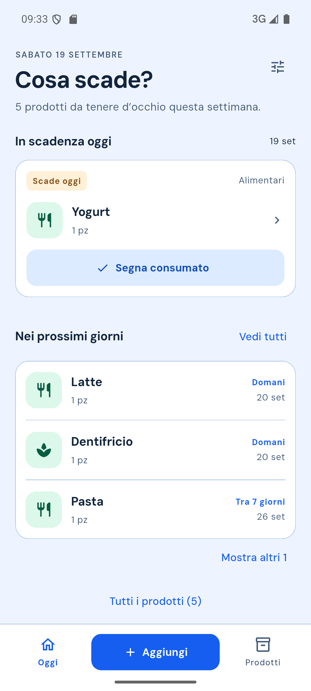
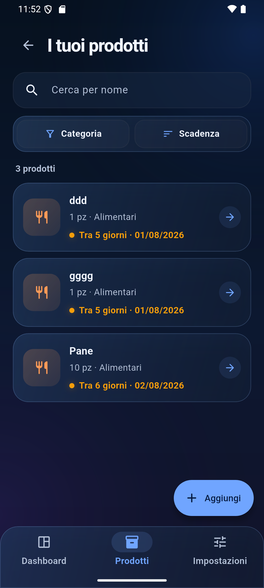
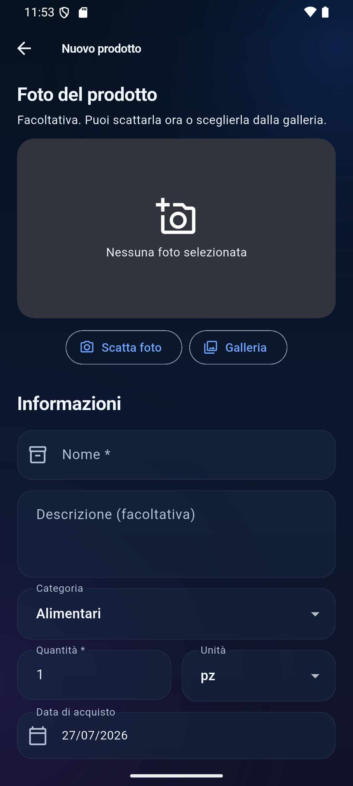
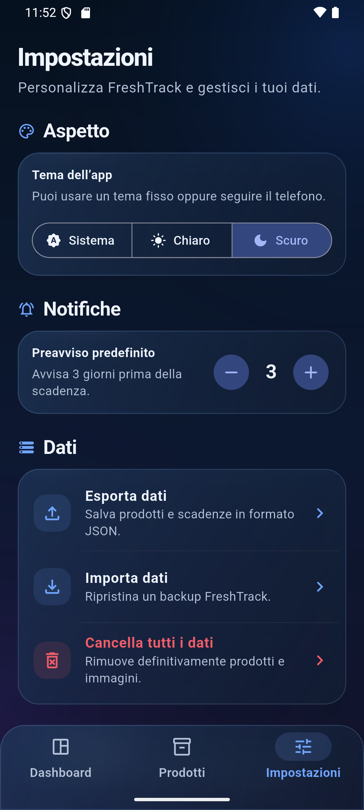

# FreshTrack

<p align="center">
  
</p>

FreshTrack è un'app Android offline-first per gestire le scadenze della
dispensa e dell'armadietto dei medicinali, riducendo sprechi e dimenticanze.

Il progetto è sviluppato in Flutter con Material 3 e Clean Architecture.
Il package Android è `io.github.kaonashi98.freshtrack` ed è mantenuto da
[Nicola Zingaro](https://github.com/Kaonashi98).

Tutti i dati restano sul dispositivo: FreshTrack non richiede account, server, API
key o connessione Internet.

## Funzionalità della versione 1.0

- Dashboard con indicatori interattivi, prime tre priorità entro sette giorni e pannelli rapidi per prodotti in scadenza o scaduti.
- Inventario con ricerca cancellabile, filtro per categoria e ordinamento per scadenza, nome o inserimento.
- Categorie della versione 1.0: Alimentari e Farmaci.
- Creazione e modifica dei prodotti con foto da fotocamera o galleria.
- Modifica ed eliminazione con flussi di conferma.
- Indicatori visivi per prodotti freschi, in scadenza e scaduti.
- Notifiche locali nel giorno della scadenza; preavviso e orario sono configurabili. Android può ritardare l’orario di alcuni minuti.
- Apertura dell'elenco corretto toccando una notifica.
- Tema chiaro, scuro o di sistema.
- Cancellazione completa di prodotti e immagini.

## Anteprima

| Dashboard | Prodotti |
| --- | --- |
|  |  |

| Nuovo prodotto | Impostazioni |
| --- | --- |
|  |  |

## Stack tecnico

- Flutter e Dart
- Material 3
- Riverpod
- GoRouter
- Drift / SQLite
- `flutter_local_notifications`
- `image_picker`
- `shared_preferences`

## Architettura

Il progetto separa regole di business, accesso ai dati e interfaccia:

```text
lib/
├── core/           # tema, router e composizione dell'app
├── data/           # Drift, repository, notifiche, impostazioni e media
├── domain/         # entità, contratti e logica delle scadenze
├── presentation/   # schermate, provider e coordinatori
└── shared/         # componenti UI riutilizzabili
```

La UI dipende dai contratti del dominio. Drift e i servizi Android rimangono
confinati nel data layer. Le modifiche ai prodotti alimentano uno stream unico,
usato anche per aggiornare e cancellare automaticamente le notifiche.

## Avvio in locale

Requisiti:

- Flutter stabile 3.44 o successivo
- Android Studio e Android SDK
- JDK 17 o successivo
- dispositivo o emulatore Android API 24+

```bash
flutter pub get
flutter analyze
flutter test
flutter run
```

## Test e qualità

La suite comprende test di dominio, repository Drift e widget test dei flussi
principali:

```bash
flutter analyze
flutter test --coverage
cd android
./gradlew :app:lintRelease
```

La workflow in `.github/workflows/flutter_ci.yml` esegue automaticamente
formattazione, analisi, test e build debug per ogni push e pull request.

## Firma Android release

Il repository non contiene chiavi o password. Le build APK/AAB release vengono
bloccate finché non è configurata un'upload key personale.

1. Copiare `android/key.properties.example` in `android/key.properties`.
2. Creare la propria chiave `.jks`.
3. Inserire in `key.properties` percorso, alias e password.
4. Generare il bundle:

```bash
flutter build appbundle --release
```

`key.properties`, file `.jks` e configurazioni SDK locali sono esclusi da Git.

## Privacy

FreshTrack non raccoglie né trasmette dati. Fotografie, inventario e preferenze
restano nella memoria privata dell'app. Consulta [PRIVACY_POLICY.md](PRIVACY_POLICY.md) per i dettagli. L’URL
pubblico da usare in Play Console, dopo aver attivato GitHub Pages, è
[https://kaonashi98.github.io/FreshTrack/](https://kaonashi98.github.io/FreshTrack/).

Per assistenza: [freshtrack.help@outlook.com](mailto:freshtrack.help@outlook.com).

## Roadmap

La versione 1.0 privilegia una gestione semplice di alimenti e farmaci. Sono pianificati
per versioni successive:

- calendario mensile delle scadenze;
- statistiche e andamento degli sprechi;
- scansione barcode;
- integrazione opzionale con Open Food Facts;
- localizzazione in altre lingue.

## Pubblicazione

- [Checklist di rilascio](docs/release_checklist.md)
- [Bozza della scheda Google Play](docs/play_store_listing_it.md)
- [Asset Google Play](docs/play-store/README.md)
- [Informativa sulla privacy](PRIVACY_POLICY.md)

## Piattaforme

La prima release supporta esclusivamente Android.

## Diritti sul codice

Copyright © 2026 Nicola Zingaro. Tutti i diritti riservati.

Il codice sorgente è pubblicato a scopo dimostrativo e di portfolio. L'assenza
di una licenza open-source non concede il permesso di copiare, modificare,
distribuire o utilizzare il progetto, in tutto o in parte.
