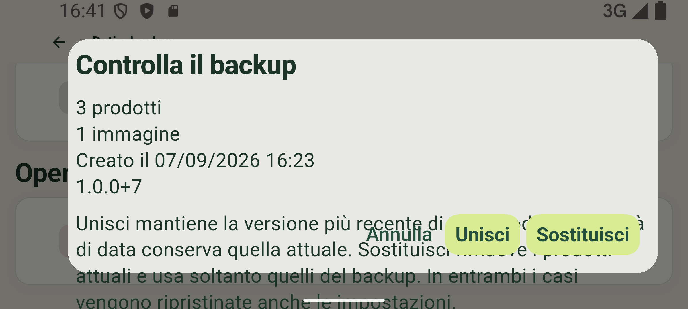
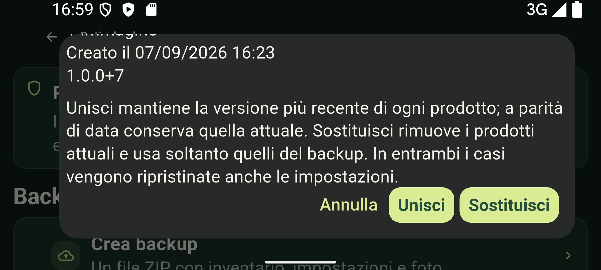

# FreshTrack: collaudo Pixel 8 e correzioni build 7

Il collaudo è ripreso il 7 settembre 2026 dopo la riapertura dell'emulatore.
Le prove reali hanno trovato **cinque difetti**, corretti nella versione
`1.0.0+7`. La suite completa aggiornata ha superato **176 test**.
Questo documento distingue i flussi osservati sul Pixel dai controlli locali
e dalle verifiche ancora necessarie su hardware fisico e Play Console.

## Problemi corretti

| Difetto riprodotto | Correzione e verifica |
| --- | --- |
| Una foto dalla galleria impediva di salvare il prodotto | Android ricomprimeva una PNG in JPEG mantenendo il suffisso `.png`. Il salvataggio riconosce ora il formato dall'intestazione e usa l'estensione corretta, mantenendo i controlli su dimensione e contenuto. La stessa foto si salva, si apre e viene esportata/ripristinata nel backup. Due regressioni sulle estensioni discordanti. |
| Aggiungi copriva la ricerca senza risultati con tastiera aperta | FAB nascosto durante l'immissione. Ricerca e azzeramento filtri verificati sul Pixel e nella vera MainShell con tastiera simulata. |
| Il CSV indicava Disponibile per un prodotto già scaduto | Lo stato esportato considera il giorno corrente; rispetta gli stati del ciclo di vita e non anticipa la scadenza di oggi. Due regressioni e nuova esportazione Android verificata. |
| La priorità della dashboard arrotondava 0.25 a 0.3 | Usa la stessa quantità esatta dell'inventario e del dettaglio. Aggiunta regressione. |
| Anteprima backup in orizzontale al 200%: testo sopra i pulsanti e fuori dalla finestra | Contenuto scorrevole nelle conferme di backup, cancellazione, prodotto e permesso notifiche. Due regressioni aprono le finestre reali, controllano leggibilità, accesso ai pulsanti e annullamento. |

File applicativi interessati da questa ripresa:

- `lib/data/media/product_image_storage.dart`
- `lib/data/backup/product_csv_export_service.dart`
- `lib/presentation/shell/main_shell.dart`
- `lib/presentation/dashboard/dashboard_screen.dart`
- `lib/presentation/settings/data_settings_screen.dart`
- `lib/presentation/products/product_details_screen.dart`
- `lib/presentation/notifications/notification_permission_prompt.dart`
- `lib/presentation/settings/notification_settings_screen.dart`
- `pubspec.yaml` per il numero build 7.

Otto test aggiunti: due immagini, due CSV, tastiera, quantità dashboard,
anteprima backup e conferma cancellazione. Si trovano in
`test/data/product_image_storage_test.dart`,
`test/data/product_csv_export_service_test.dart`,
`test/presentation/main_screens_test.dart` e
`test/presentation/settings_screen_test.dart`.

## Dispositivo e metodo

- AVD `Pixel_8`, `emulator-5554`, Android API 35, x86_64.
- 1080 × 2400; prove verticali e orizzontali, font Android 100% e 200%.
- Pagine da 4096 byte: nessuna prova runtime a 16 KB.
- Package `io.github.kaonashi98.freshtrack`, min SDK 24, target SDK 36.
- Il dispositivo indicava 7 settembre 2026, fuso GMT. Le attese sulle scadenze
  usano la data effettiva del dispositivo.
- Interazioni tramite ADB, finestre native, screenshot e XML `uiautomator`.
  Le prove iniziali sono sulla release 6; le correzioni sono state riprovate
  progressivamente sulle compilazioni della release 7.
- Le copie QA usano la stessa firma Android Debug dell'installazione
  preesistente. Sono release non debuggable, con codice e risorse identici
  all'APK di distribuzione: tutti i 402 elementi ZIP originali confrontati.
  Cambiano solo le firme e i tre elementi `META-INF` della firma QA.
  Gli APK/AAB destinati alla distribuzione mantengono la upload key.
- Nel successivo test di reinstallazione è stato installato direttamente
  l'APK release originale con upload key, senza rifirmarlo. Avvio a freddo
  riuscito in 3421 ms. Questa è la firma lasciata nell'installazione finale.
- Non è una prova di installazione tramite Play o del certificato Play App Signing.

## Flussi osservati

I numeri sono i prefissi delle acquisizioni in `build/emulator-qa-v6/`,
cartella locale ignorata da Git. Una selezione è in
[`screenshots/emulator-qa-resumed/`](screenshots/emulator-qa-resumed/).
Il dump XML precede lo screenshot: i messaggi brevi possono comunque non
comparire in entrambi. Le prove 01–24 restano nel
[resoconto iniziale](emulator_qa_2026-09-07.md).

| Area | Risultato osservato | Evidenze |
| --- | --- | --- |
| Avvio e persistenza | Aggiornamento senza perdita dei due prodotti precedenti; dopo la riapertura del Pixel, il prodotto del 6 settembre è scaduto il 7 | 01, 27 |
| Inventario vuoto | Dashboard con Aggiungi; Prodotti con CTA interna e senza FAB duplicato | 01, 02 |
| Inserimento | Nome obbligatorio, date rapide, salvataggio consecutivo e modulo azzerato dopo Salva e aggiungi un altro | 03–12 |
| Modifica | Quantità 0.25 e descrizione `=1+1` conservate | 28–34, 70 |
| Ciclo di vita | Alimentare consumato, buttato con annullamento/conferma e ripristino disponibile; Farmaco usa Utilizzato | 35–41 |
| Duplicazione | Modulo precompilato e nuovo QA Farmaco salvato senza modificare l'originale | 39–41 |
| Ricerca e filtri | Ricerca senza distinzione maiuscole, nessun risultato, azzeramento, categoria Farmaci, ordine alfabetico | 42–47, 67 |
| Foto galleria | Salvataggio dopo la correzione e apertura a schermo intero | 70, 71 |
| Foto fotocamera | Fotocamera Android, scatto accettato e salvato; rimozione della foto tramite modifica | 89–96 |
| OCR | Foto singola; produzione e scadenza proposte entrambe; scelta 30/09/2026 applicata; immagine bianca gestita senza cambiare la data | 09, 11, 85–87 |
| Scanner | Diniego fotocamera gestito, nuova richiesta e consenso; camera virtuale visibile, uscita funzionante | 59–65 |
| CSV | Salvataggio nativo in Download; UTF-8/BOM, 9 colonne, tre righe; 0.25 esatto, formula preceduta da apostrofo, QA Latte Scaduto | 80–81, `export-v7.csv` |
| Backup con foto | ZIP valido, tre prodotti e una JPEG decodificabile; impostazioni incluse | 72–73, `backup-with-photo.zip` |
| Unisci | Prodotto con foto eliminato, poi recuperato; tre prodotti/una immagine, senza duplicazioni | 74–79 |
| Sostituisci | Recuperato QA Latte eliminato; rimosso il prodotto Fotocamera aggiunto dopo il backup; tre prodotti e una foto finali | 112–116 |
| File non valido | ZIP con manifest JSON malformato non apre l'anteprima e non cambia i tre prodotti | 82–83 |
| Dashboard | Pannelli In scadenza e Scaduti coerenti; cancellazione di tutti gli scaduti prima annullata poi confermata, contatore a zero | 108–113 |
| Temi | Chiaro/scuro applicati; Sistema segue il cambio di modalità Android | 97–101 |
| Testo grande | Aspetto, Dashboard, Prodotti e Dati al 200%; trovato e corretto il difetto della conferma in orizzontale | 101–107 |

## Notifiche e rete

Permesso concesso dal dialogo Android. Orario modificato da 09:00 a 16:12 e
letto nuovamente nelle impostazioni. Android ha registrato l'allarme e, con
FreshTrack in background, la notifica **QA Farmaco scade oggi** è stata
osservata alle 16:15. Il tap ha aperto **Scadono oggi**, data 07/09/2026,
con il solo QA Farmaco. Evidenze 48–58.

L'osservazione alle 16:15 non prova la consegna esatta alle 16:12: il
promemoria usa allarmi non esatti e la UI avvisa dei possibili ritardi.

Verificato anche il preavviso: QA Preavviso scade l'8 settembre, preavviso
globale di un giorno e orario 16:54. App in background dalle 16:50; notifica
osservata alle 16:57. Il tap apre **Scadenze del 08/09/2026**, con il solo
QA Preavviso (1 di 4 prodotti). Evidenze 117–124; allarmi nativi nel file
`prewarning-alarms.txt`. Anche in questo caso non si attribuisce alla consegna
una precisione al minuto non osservata.

Sul computer è stato eseguito anche il servizio Open Food Facts usato
dall'app: `3017620422003` restituisce Nutella e `9999999999999` restituisce
Salatgurke. Quest'ultimo esiste nel database e non prova il caso assente.
Log `live-lookup.log`, script archiviato come `live_lookup.dart.txt`.
È una verifica di rete del servizio, non una scansione barcode sul Pixel.

## Controlli locali

- Suite completa aggiornata **176/176**, `tests-v7-all-fixes-final.log`.
- `flutter analyze --no-pub`: nessun problema,
  `analyze-v7-all-fixes-final.log`.
- I test dei dialoghi aprono la schermata reale con un selettore file simulato
  e un'anteprima controllata. La prova nativa di importazione è separata.
- Android Lint `:app:lintRelease` rieseguito sulla build corrente: successo,
  rapporto `No issues found`, log `lint-v7-final.log`.
- Formattazione finale: 76 file, zero modifiche; `format-v7-final-direct.log`.
- APK/AAB release generati, firma e versione controllate; `bundletool validate`,
  `jarsigner` (`jar verified`) e `zipalign -c -P 16 -v 4` superati.
- Configurazione AAB `PAGE_ALIGNMENT_16K`; segmenti LOAD delle 18 librerie
  native a 64 bit di ciascun pacchetto allineati ad almeno 16 KB.

| Pacchetto 1.0.0+7 | Byte | SHA-256 |
| --- | ---: | --- |
| [APK release](../build/app/outputs/flutter-apk/app-release.apk) | 114760335 | `3cce71222b82128bf1f378ffd6e3df2ad3e917c1f0a91af6d67d4bcef921c1f0` |
| [AAB release](../build/app/outputs/bundle/release/app-release.aab) | 88735769 | `d1676694cb2b3992b22833c94a0895bdcc69a8251305a17baae959b39a043717` |

Snapshot input invariato durante la compilazione: `source-v7.json`, SHA-256
normalizzato `536916586f16367fc03ae4a957307a25e816d7f31320caa9fd8362db6bfd6dfe`.
La firma upload ha certificato SHA-256
`6832bdc0f1ae2876827fabfee57ae65ded344902e7b004cb0e06574c5348477c`.
La copia `freshtrack-v7-final-qa.apk` ha SHA-256
`fb4e9fd94b6cdbadd53b043ad5fd1b2602c7697761651c07ed721deff6d80323`;
confronto dei 402 elementi in `payload-v7-final-verification.json`.

I log conservano gli avvisi Kotlin di mobile_scanner e accesso nativo Java.
`jarsigner` segnala certificato autofirmato/catena non attendibile, assenza di
timestamp, attributi POSIX e differenze JarFile/JarInputStream per l'ordine del
  manifest. I comandi di verifica terminano con successo; non sono un'approvazione
Play. Nessuna chiave privata o password è riportata nei resoconti.

## Verifica finale sul pacchetto originale

La reinstallazione dell'APK con upload key è riuscita. SHA-256 dell'APK
installato letto direttamente dal Pixel e confrontato con quello locale:
`3cce71222b82128bf1f378ffd6e3df2ad3e917c1f0a91af6d67d4bcef921c1f0`.
Log `installed-final-sha256.txt`.

- Backup ripristinato dopo reinstallazione: tre prodotti e una foto,
  visualizzata anche a schermo intero; tema scuro e orario 16:12 recuperati.
  I permessi Android restano negati dopo reinstallazione e la pagina Notifiche
  lo segnala correttamente: il backup non concede permessi di sistema.
- Dashboard del pacchetto definitivo: 0.25 esatto, contatori 3/1 coerenti.
- Ricerca del pacchetto definitivo: nessun FAB sopra la tastiera.
- Anteprima backup in orizzontale al 200% scorrevole, testo separato dai pulsanti;
  Sostituisci utilizzato nella stessa configurazione. Conferma Cancella dati
  verificata anche in orizzontale al 200%.
- Backup malformato: messaggio **Manifest del backup danneggiato.**
  L'inventario esistente resta intatto.

Evidenze finali 125–138.

| Conferma prima della correzione | Conferma corretta, dopo lo scorrimento |
| --- | --- |
|  |  |

Il [resoconto del ridisegno](ui_redesign_2026-09-07.md) conserva la storia e le
anteprime della build 6. Pacchetti precedenti archiviati in
`build/emulator-qa-v6/app-release-v6-original.apk` e
`app-release-v6-original.aab`.

## Limiti ancora da chiudere per il rilascio

- Decodifica effettiva barcode dalla camera, prodotto assente e assenza di rete
  nell'intero flusso sul dispositivo. Le immagini EAN caricate nella scena
  virtuale non erano nell'inquadratura: nessuna scansione riuscita viene
  attribuita a questa prova.
- Fotocamera, torcia fisica, OCR e notifiche su un telefono reale, compresi
  risparmio energetico e ripristino notifiche dopo riavvio Android.
- Runtime a 16 KB e installazione dell'AAB attraverso Play.
- Privacy pubblica aggiornata, dichiarazioni e scheda store, disponibilità
  versionCode, CI sul commit definitivo, test track e rapporti Play Console.
  Nessuna pubblicazione o verifica dello stato corrente della Console in questa sessione.

Le prove non certificano l'assenza assoluta di difetti e non chiudono da sole
la [checklist di rilascio](release_checklist.md).

## Dati del Pixel

L'inventario originale conteneva **zero prodotti**. Prima delle prove erano
stati salvati APK precedente, dati privati e copia SQLite. I prodotti creati
durante il collaudo sono tutti QA.

- Originali: `installed-before.apk`, `data-before.tar`,
  `database-before.sqlite`, `inventory-before.json` in `build/emulator-qa-v6/`.
- SHA-256 dell'archivio iniziale:
  `a3ffa796aaa86a592162649ca864c4a6fc074404874343e1dbc2c1c63e5e38de`.
- Preferenze iniziali: scuro, zero giorni di preavviso, 09:00.
- Permessi iniziali: Fotocamera e Notifiche negati.
- Scena virtuale della camera riportata ai valori predefiniti dopo la prova barcode.

Il precedente blocco dei servizi Android è documentato nel resoconto iniziale.
Dopo la riapertura il collaudo ha proseguito; il vecchio esito di sola
interruzione è superato per i flussi qui completati.

### Stato finale verificato

- Cancellazione prima annullata, poi confermata: messaggio «Tutti i dati sono
  stati cancellati». Un nuovo backup esportato dopo la cancellazione contiene
  **zero prodotti, nessuna immagine e solo il manifest**, con tema scuro,
  preavviso 0 e orario 09:00. Copia locale `backup-after-cleanup.zip`.
- Dashboard ed elenco mostrano zero prodotti; ritorno dal background riuscito.
- Fotocamera e Notifiche risultano nuovamente non concesse nelle autorizzazioni
  Android. Nessun allarme futuro FreshTrack presente in `dumpsys alarm`.
- Font 1.0, rotazione automatica attiva e orientamento 0, modalità Android
  chiara: impostazioni del dispositivo riportate ai valori iniziali.
- Rimosse soltanto le tre immagini `freshtrack-qa-*.png`, i cinque CSV/ZIP QA
  in Download e il dump XML temporaneo. I file precedenti e i dati delle altre
  app sono stati preservati. L'archivio originale `data-before.tar` è invariato.
- APK release originale build 7 lasciato installato, app aperta sulla dashboard.
  Verificati nuovamente hash degli artefatti e snapshot dei sorgenti dopo Lint.
- Nel log raccolto del processo dell'APK finale non compaiono `FATAL EXCEPTION`,
  `Unhandled Exception`, `E/flutter` o `ANR in`. Anche il log del precedente
  processo build 7 era privo di queste segnalazioni. Questo vale per i campioni
  acquisiti, non per tutti i telefoni o tutte le condizioni possibili.

Evidenze 139–145; riepilogo leggibile automaticamente `final-state.json`,
log `final-logcat.txt`, `final-package.txt` e `final-alarms.txt` nella cartella QA.
Non sono stati eseguiti commit, push, deploy o pubblicazioni.
