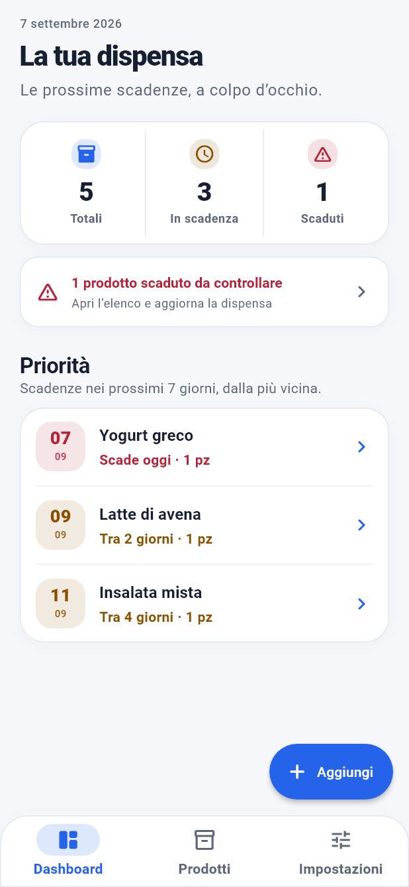
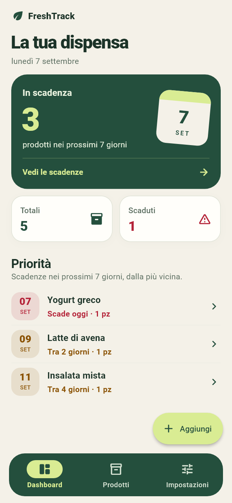
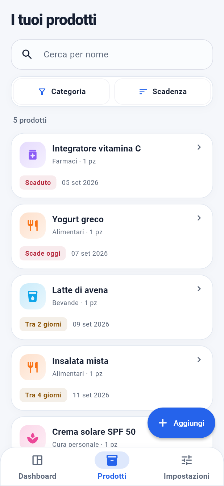
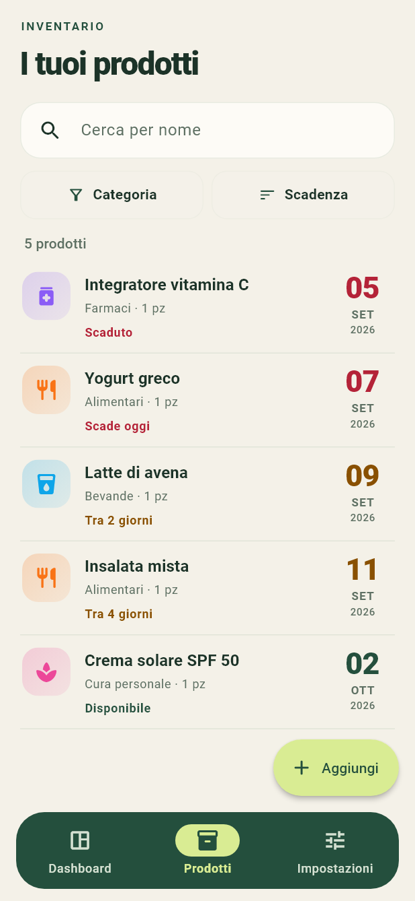
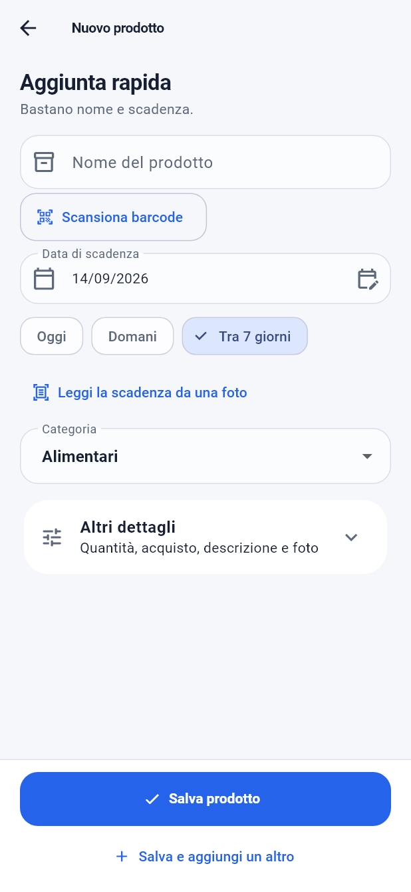
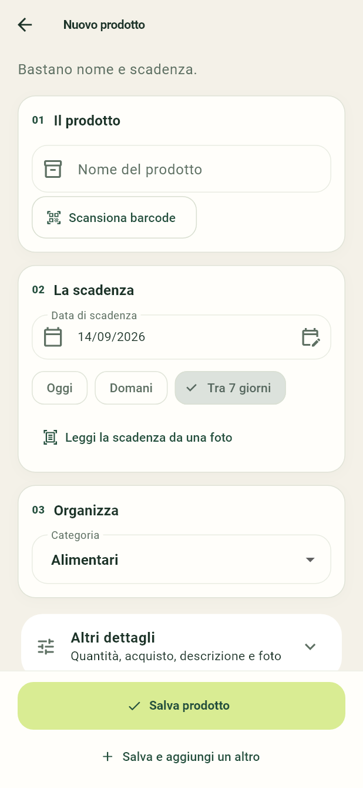

# FreshTrack — ridisegno UI/UX, build 6

La build `1.0.0+6` introduce una nuova composizione delle schermate principali:
verde bosco, avorio e lime, scadenze più evidenti e navigazione sospesa.
La revisione riguarda undici file dell’interfaccia e mantiene le correzioni
funzionali realizzate nelle build precedenti.

## Confronto prima / dopo

Le immagini provengono dai widget Flutter effettivi, con gli stessi prodotti
dimostrativi e la stessa data, 7 settembre 2026. La colonna Prima mostra la
build 5; Dopo mostra il ridisegno della build 6. Sono rendering locali, non
fotografie di uno smartphone né immagini generate.

| Dashboard — prima | Dashboard — dopo |
| --- | --- |
|  |  |

| Prodotti — prima | Prodotti — dopo |
| --- | --- |
|  |  |

| Inserimento — prima | Inserimento — dopo |
| --- | --- |
|  |  |

## Modifiche realizzate

- **Dashboard:** identità FreshTrack nell’intestazione; grande riepilogo verde
  delle scadenze entro sette giorni, con conteggio e calendario della prima
  scadenza effettiva. Toccandolo si apre l’elenco pertinente. Totali e scaduti
  hanno due riquadri distinti. Le priorità diventano righe aperte, ordinate per
  data. Quando non ci sono scadenze vicine, resta il richiamo agli scaduti.
- **Prodotti:** elenco senza una cornice intorno a ogni elemento; miniatura,
  nome, categoria e quantità a sinistra, giorno/mese/anno della scadenza a
  destra. Lo stato resta espresso anche a parole. Ricerca e filtri occupano
  aree distinte e mantengono il ripristino con un tocco.
- **Inserimento e modifica:** tre sezioni numerate, Il prodotto, La scadenza
  e Organizza. Barcode, lettura della data da foto, date rapide e suggerimenti
  rimangono disponibili. Il salvataggio principale resta fisso in basso;
  i dettagli facoltativi sono raccolti in una sezione espandibile.
- **Dettaglio:** scadenza presentata come un calendario con giorno in grande,
  mese/anno e messaggio di stato. Informazioni e azioni seguono la stessa
  gerarchia cromatica del resto dell’app.
- **Impostazioni:** due gruppi, La tua esperienza e Dati e informazioni, con
  descrizioni brevi e un riquadro dedicato ai dati locali. Con testo grande,
  quest’ultimo passa dopo le azioni, rendendole più rapide da raggiungere.
- **Navigazione e tema:** barra verde arrotondata e distanziata dai bordi,
  destinazione attiva lime, pulsanti principali lime, superfici avorio e tema
  scuro coordinato. Su schermi con testo grande Aggiungi diventa un pulsante
  compatto, con la stessa etichetta accessibile.
- **Leggibilità:** intestazioni adattive; date senza icone laterali quando
  queste toglierebbero spazio; etichetta Nome più breve nel modulo; elenco
  prodotti disposto su più righe con testo al 200%.

Le regole dell’inventario vuoto sono conservate: Aggiungi nella dashboard,
azione interna in Prodotti senza un secondo pulsante flottante, nessuna azione
di aggiunta nelle Impostazioni o durante caricamento/errore.

## Altre schermate

| Tema chiaro | Tema scuro |
| --- | --- |
| [Dashboard](screenshots/ui-redesign-v6/light-dashboard.png) | [Dashboard](screenshots/ui-redesign-v6/dark-dashboard.png) |
| [Prodotti](screenshots/ui-redesign-v6/light-products.png) | [Prodotti](screenshots/ui-redesign-v6/dark-products.png) |
| [Inserimento](screenshots/ui-redesign-v6/light-products-new.png) | [Inserimento](screenshots/ui-redesign-v6/dark-products-new.png) |
| [Dettaglio](screenshots/ui-redesign-v6/light-products-Yogurt-greco.png) | [Dettaglio](screenshots/ui-redesign-v6/dark-products-Yogurt-greco.png) |
| [Impostazioni](screenshots/ui-redesign-v6/light-settings.png) | [Impostazioni](screenshots/ui-redesign-v6/dark-settings.png) |

Le varianti `compact-` nella stessa cartella documentano anche il layout a
320×568 con testo al 200%. Le anteprime normali sono a 412×892; i PNG sono
esportati a 1,5× per mantenerne la leggibilità.

## Verifiche e limiti

- Analisi statica Flutter: nessun problema.
- Suite completa: **168 test superati**. Dopo le ultime correzioni dei colori
  e della navigazione: **86 test UI e di contrasto superati**.
- Verifica dei colori effettivi dei testi Mostra tutti, della sua descrizione
  e dei due dialoghi di eliminazione: rapporto di contrasto almeno **4,5:1**
  in tema chiaro e scuro. Sei ulteriori anteprime nella cartella `states`.
- Pulsanti di eliminazione abbinati ai colori di errore del tema; Modifica e
  Mostra tutti distinti dalle azioni principali. Sfondo opaco attorno alla
  navigazione sospesa per evitare testo visibile sotto i margini.
- Suite responsive finale: 31 test superati, comprese le schermate piccole,
  l’orientamento orizzontale e il testo al 200%.
- Venti anteprime delle cinque schermate principali, in tema chiaro/scuro e
  nelle due configurazioni di schermo e testo.
- I controlli hanno portato a correggere anche il titolo troppo largo con
  caratteri ingranditi e la data spezzata nel modulo.
- Due verifiche esistenti del modulo sono state aggiornate al nuovo titolo
  Il prodotto; le verifiche dei dati salvati e della duplicazione restano.
- Nessuna dipendenza aggiunta per il design; nessuna modifica alla persistenza,
  ai backup o alla pianificazione delle notifiche in questa revisione.

Il collaudo su dispositivo fisico e i controlli di Play Console restano
necessari per giudicare la pubblicazione. Queste verifiche locali non provano
il comportamento della fotocamera, dell’OCR o delle notifiche su ogni telefono.

Il progetto conserva le modifiche locali precedenti. Non sono stati eseguiti
commit, push, deploy o pubblicazioni.

## Pacchetti della build 6, archiviati

Il candidato attuale è la build 7, descritta nel
[collaudo Pixel aggiornato](emulator_qa_build7_2026-09-07.md).
I collegamenti seguenti puntano alle copie conservate della build 6.

Entrambi i pacchetti contengono **1.0.0+6**, package
`io.github.kaonashi98.freshtrack`, min SDK 24 e target/compile SDK 36.

| Pacchetto | Dimensione | SHA-256 |
| --- | --- | --- |
| [APK build 6](../build/emulator-qa-v6/app-release-v6-original.apk) | 109.44 MiB | `5f11889e8b9b3f5921f7c2164678762b69a7f47775e1ca1002875136284b5a6d` |
| [AAB build 6](../build/emulator-qa-v6/app-release-v6-original.aab) | 84.62 MiB | `1a2cee4d14ef01dc79e5fdaf7c741694aa0802f9315636409a1950bb7f6460b4` |

- APK: `apksigner verify` riuscito, firma v2 con la upload key personale;
  `zipalign -c -P 16 -v 4` riuscito.
- AAB: `bundletool validate` riuscito e `jarsigner` restituisce `jar verified`.
  Configurazione `PAGE_ALIGNMENT_16K` verificata.
- Le 18 librerie native a 64 bit di ciascun pacchetto hanno tutti i segmenti
  LOAD con allineamento di almeno 16 KB.
- Snapshot degli input rimasto invariato durante la compilazione:
  `build/ui-redesign-v6/source-manifest.json`, SHA-256 normalizzato
  `c944b85351fda034750edb17b7f0e59de668c0fee1752557ce1c28448577d127`.
- Log di build e verifica in `build/ui-redesign-v6/`. APK build 5 e AAB build 4
  sono conservati nella stessa cartella con il numero della rispettiva build.

Gli strumenti segnalano ancora gli avvisi di migrazione Kotlin del plugin
mobile_scanner e di accesso nativo Java. `jarsigner` segnala certificato
autofirmato/catena non attendibile, assenza di timestamp, attributi POSIX e
differenze di lettura fra JarFile e JarInputStream (manifest non in testa
all’archivio). Le verifiche terminano con successo; gli avvisi restano
documentati, senza presentare il controllo locale come approvazione di Play.

Le immagini promozionali precedenti riportano la vecchia interfaccia e vanno
riacquisite dal candidato definitivo prima della pubblicazione.
